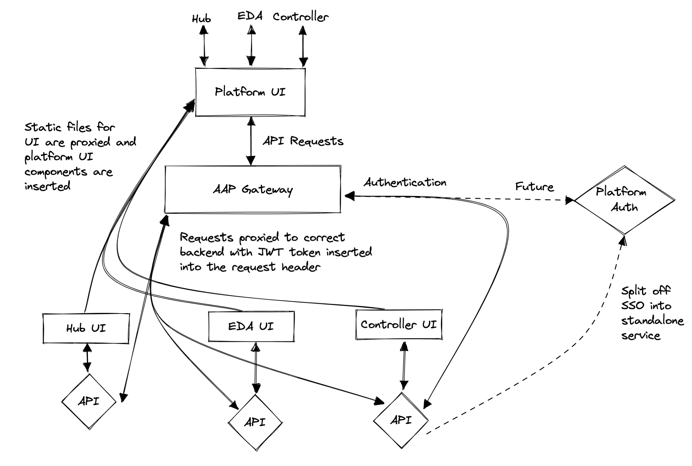

## AAP Gateway

This is a prototype for unified AAP UI and authentication. It works by hooking into the awx authentication to authenticate other apps under the AAP umbrella.

### Run it

Configure the the urls that the proxy points to in main.go and launch the proxy with `go run main.go`.

AWX and GalaxyNG are required to be running using the following checkouts
- GalaxyNG https://github.com/newswangerd/galaxy_ng/tree/feature/aap-gateway ([diff](https://github.com/ansible/galaxy_ng/compare/master...newswangerd:galaxy_ng:feature/aap-gateway))
- GalaxyNG UI https://github.com/newswangerd/ansible-hub-ui/tree/feature/aap-gateway ([diff](https://github.com/ansible/ansible-hub-ui/compare/master...newswangerd:ansible-hub-ui:feature/aap-gateway))
- AWX https://github.com/newswangerd/awx/tree/feature/app-gateway ([diff](https://github.com/ansible/awx/compare/devel...newswangerd:awx:feature/app-gateway))

### Architecture

### Demo

